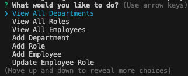

# Employee Tracker

## Description
This SQL employee tracker was created to allow users to manage an employee database. I used Node.js, Inquirer and MySQL to create the application. This project taught me how to create a connection to an SQL database, use MySQL queries to edit data in a database, use database data to dynamically create lists in Inquirer, use the .find() and .map() methods and more.

Video here: https://app.screencastify.com/v3/watch/1hZL0pgjzVpS0D69GQ56

## Installation
Inquirer: https://www.npmjs.com/package/inquirer?activeTab=readme

MySQL: https://www.npmjs.com/package/mysql2

## Usage

The application allows users to view all departments, roles and employees, as well as add departments, roles and employees. Users can also update employee roles.

## Credits
Node.js MySQL queries: https://www.w3schools.com/nodejs/nodejs_mysql_insert.asp

Find() method: https://developer.mozilla.org/en-US/docs/Web/JavaScript/Reference/Global_Objects/Array/find

Map() method: https://developer.mozilla.org/en-US/docs/Web/JavaScript/Reference/Global_Objects/Array/map

## License
n/a